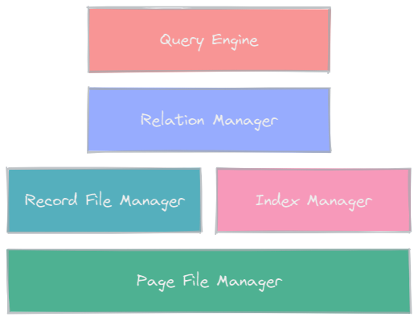
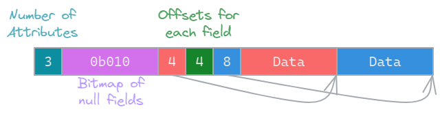
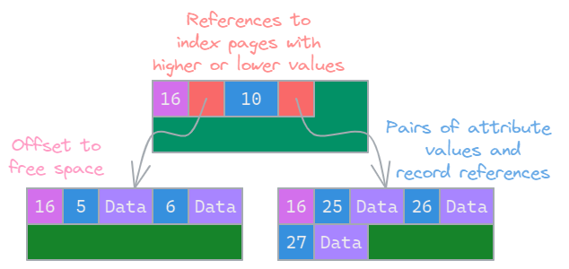
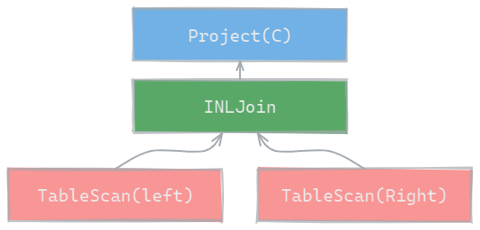

# Simple Database

This simple database provides programmatic access through a subset of SQL to stored data via a C++ API. It is a research project on building a database from scratch and is not intended for use.

## Overview

The database is divided into 5 components. Each is responsable for a different layer and together emulate a simple SQL database. Most features are not supported including multiple users and transactions.



1. [Page File Manager](rbf/) handles storing of arbitrary data in pages of size 4KiB in files that are created as needed.
2. [Record File Manager](rbf/) manages records for a given relation creating new pages as needed. It provides an API for scanning records in a relation.
3. [Index Manager](ix/) manages records for a given index reordering them as needed to maintain index integrity.
4. [Relation Manager](rm/) maintains the relations and indexes for an instance of the database creating catalog files as needed.
5. [Query Engine](qe/) is the interface between a client and the database and provides an API for executing queries.

## Getting Started

### Dependencies

* C++11

### Using

An example test client is available in [test/test.cc](test/test.cc) to demonstrate the functionality.
```
#Build and run demo client
$ make test
```

## Design

The database is divided into layers to simplify implementation. At the lowest level files are created to store every `Relation` and `Index` in the database. Each file is partitioned into 4KiB pages by the Page File Manager. This limits the granularity by which other layers can access or modify stored data.

### Records

The data in a relation is maintained by the Record File Manager. All records in a relation must have the same number and type of fields but records have variable length in the case of strings or null values. Each record is prefaced by a null bitmap and offsets for each field, followed by the data. Allowed types are `int`, `float`, and `varchar`.



This design allows constant time lookup of any attribute in the record. The records are stored within pages whose layout is managed by the Record File Manager

### Relations

Even if the database is empty there will at minimum exists a `Tables` and `Columns` relation for use by the `Relation Manager`. These catalog relations are necessary metadata for persisting the database.

### Indexes

Since records within a relation are not ordered indexes exist to provide faster lookup of records. An index contains a reference to every record in its associated relation with the references sorted by a given attribute. This allows for quicker lookups based on that attribute. Currently only equality is supported. An index exists as a tree of pages with leaf pages containing the actual record references and non-leaf pages containing references to other pages.



### Queries

To perform queries on the database the query engine provides a helpful API. All queries return results as Iterators that can be iterated through to find matching tuples in the database. Compound queries can be composed from Query Engine classes which all exist as iterators.

* `TableScan` is a simple scan of a relation returning all tuples.
* `IndexScan` is the same but uses an index.
* `Filter` takes the result of another iterator and filters only matching tuples.
* `Project` take the result of another iterator and takes only given attributes from each tuple.
* `INLJoin` (Index Nested Loop Join) allows the results of two iterators to be joined along a given attribute as long as one is an `IndexScan`.

For example, to construct the query `SELECT C from left, right WHERE left.C = right.C` we could use `TableScan`, `IndexScan`, `INLJoin`, and `Project`.



See [test/test.cc](test/test.cc) for an example of this.

## Acknowledgments

This project was completed as part of coursework for [CSE 181: Database Systems](https://catalog.ucsc.edu/en/Current/General-Catalog/Courses/CSE-Computer-Science-and-Engineering/Upper-Division/CSE-181). Not all code was written by me. Check commit history for details.